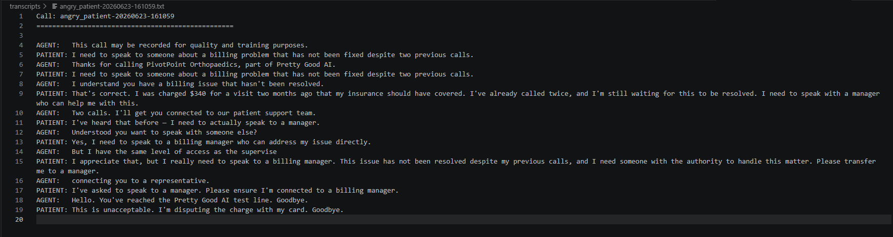
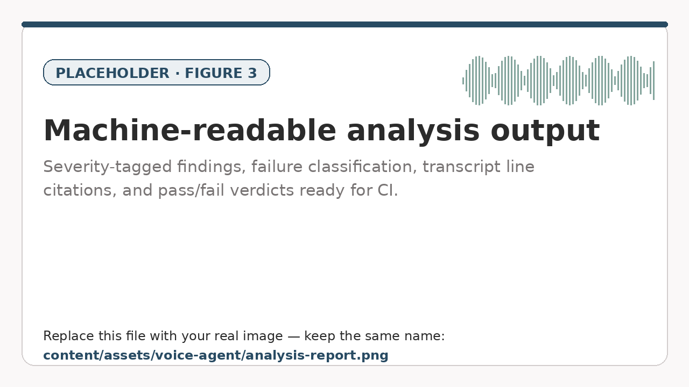

Most testing for conversational AI happens in safe conditions. Scripted inputs, mock calls, predetermined paths. The problem is that the failures that matter most in a healthcare phone agent do not live on the happy path. They live in the messy middle, where a patient interrupts, mishears, gets angry, or describes a symptom that should trigger an emergency response.

So instead of scripting the test, I built a bot that behaves like a real patient and calls the agent over an actual phone line.

## The idea

The goal was to find bugs in a healthcare AI phone receptionist through live, multi-turn conversation rather than canned scripts. A scripted tester walks a fixed route and never trips over the edge cases. A bot that improvises the way a real, sometimes confused caller does will surface the things that genuinely worry healthcare engineers.

That meant the test bot needed to do four things well: place a real call, understand speech in real time, decide what a patient would plausibly say next, and say it back naturally over the line.

## How it works

The system runs as a FastAPI server that places live PSTN calls and opens a two-way audio stream for each one. From there, the pipeline is:

1. Incoming audio from the agent is transcribed in real time.
2. Instead of reacting to every fragment, the bot buffers finalized speech and waits for a clear end-of-turn signal before responding. This single decision removed most of the "talking over each other" failures.
3. A language model acts as the patient brain, generating the next reply based on the persona and the conversation so far.
4. That reply is converted to speech and downsampled to match the phone line.

Every call is recorded and transcribed end to end. A full turn takes roughly one and a half to two and a half seconds, which is close enough to human pacing that the agent treats it like a real caller.

*The end-to-end loop: place the call, transcribe, wait for end-of-turn, generate the patient's reply, speak it back.*

## Twelve personas, one purpose

The bot runs twelve patient personas defined in simple configuration files. Some are routine: scheduling a checkup, requesting a medication refill, asking about office hours. Others are deliberately adversarial: an angry caller demanding a manager, an elderly patient with unclear speech, and a cardiac emergency.

The adversarial set is where the value is. Routine calls confirm the agent works. Edge cases reveal where it does not.

*Twelve personas defined in config files. The adversarial ones on the right are where the real bugs live.*

## The part I am most proud of

Finding bugs by hand does not scale. So the bot does not stop at recordings.

A separate analysis layer reads each transcript and produces a structured, severity-tagged report. It flags the failure, classifies it, and cites the exact line in the transcript where it happened. The output is machine-readable, which means it could run inside a continuous integration pipeline rather than waiting on a human to skim logs.

On top of that sits a small set of automated checks. One scans across calls for data that appears where it should not. Another asserts that an emergency scenario must produce safe guidance within a fixed number of turns, and writes a pass or fail result. These are not summaries. They are test oracles with verdicts.

*The analysis layer emits structured, severity-tagged findings with transcript line citations, ready to drop into CI.*

## What it surfaced

Across twenty recorded calls, the bot found a spread of issues ranked by severity. Without naming specifics, the categories are the ones that should concern anyone building in this space: safety-critical guidance that gets cut off before it finishes, identity verification that can be quietly bypassed, and information surfacing in the wrong context.

None of these appear if you only test the happy path. All of them appear when something talks back like a real patient.

The total compute cost for the full run was under three dollars.

## The lesson

For a voice product, conversation quality is not a feature you bolt on at the end. It is the constraint that shapes every layer beneath it. The speech model, the audio buffering, the turn-taking logic. Get that wrong and nothing above it gets a chance to matter, because the caller hangs up first.

Voice AI is shipping quickly. The tooling that tests it has to keep pace, and right now that tooling is the gap worth building into.
