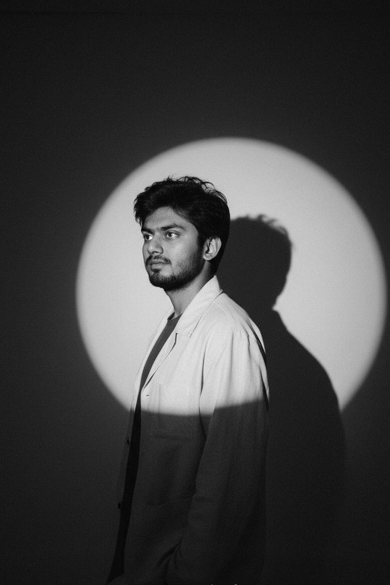

## Welcome

I am Bhargav Limbasia, a Graduate Student in Applied Data Science at USC and an aspiring AI/ML Engineer and Researcher.

This Quartz site is my Obsidian-style digital garden with notes on:

- [[about|About me]]
- [[experience/index|Experience]]
- [[projects/index|Featured projects]]
- [[project-lab/index|Project lab]]
- [[skills|Skills]]
- [[education|Education]]
- [[certifications|Certifications]]
- [[blog/index|Blog]]
- [[contact|Contact]]

## Current focus

- Research Assistant on pediatric brain tumor segmentation (BraTS-PEDs)
- Vision-Language-Action systems for bimanual robotic manipulation
- Production-ready machine learning systems and reproducible experimentation

## Quick links

- Resume: [Bhargav_Limbasia_Resume.pdf](./assets/Bhargav_Limbasia_Resume.pdf)
- GitHub: [Bhargav021](https://github.com/Bhargav021)
- GitHub Alt: [TheDeal9](https://github.com/TheDeal9)
- LinkedIn: [bhargavlimbasia](https://www.linkedin.com/in/bhargavlimbasia/)
