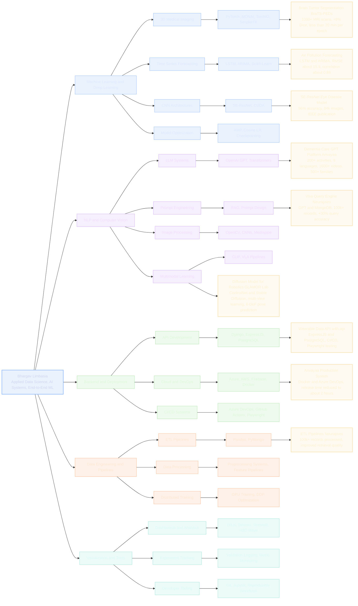

## Skill-to-Impact Map

This map ties what I know to what I have shipped, including measurable outcomes.

## Primary Domains

- Machine Learning and Deep Learning
- NLP and Computer Vision
- Backend and Deployment
- Data Engineering and Pipelines
- Visualization and Tools

## Key Design Notes

- Color-coded domains make cluster boundaries obvious in dark mode.
- The ML branch is intentionally denser to reflect strongest depth.
- Outer-ring project nodes include metrics so capability can be verified quickly.

## Project Cards

<h3 id="card-brats">Brain Tumor Segmentation - BraTS-PEDs</h3>

- Problem: pediatric MRI segmentation with class imbalance and noisy labels.
- Approach: TorchIO and MONAI preprocessing, 3D modeling, composite losses, and optimized training.
- Tech: PyTorch, MONAI, TorchIO, SimpleITK.
- Metrics: 1000+ MRI scans, +8% Dice, less than 20 minutes per epoch.
- Link: [BraTs Challenge](https://github.com/Bhargav021/BraTs-Challenge-6)

<h3 id="card-air">Air Pollution Forecasting</h3>

- Problem: non-stationary PM2.5 and PM10 forecasting.
- Approach: time-series feature engineering with hybrid LSTM and ARIMA modeling.
- Tech: LSTM, ARIMA, Scikit-Learn.
- Metrics: RMSE about 15.9 and correlation about 0.88.

<h3 id="card-oct">SE-ResNet Eye Disease Model</h3>

- Problem: automate retinal OCT classification for faster screening.
- Approach: SE-ResNet architecture with augmentation and scheduled optimization.
- Tech: SE-ResNet, CUDA, CNN workflows.
- Metrics: 96% accuracy on 84k images with IEEE publication output.

<h3 id="card-anvayaa-gpt">Dementia Care GPT Platform - Anvayaa</h3>

- Problem: multilingual dementia-care support at scale for families.
- Approach: productized GPT workflows and personalized activity generation.
- Tech: OpenAI GPT, prompt design, backend integration.
- Metrics: 200+ activities, 9 languages, 1600+ videos, adopted by 500+ families.

<h3 id="card-visa">Visa Query Engine - Neurapses</h3>

- Problem: accurate policy search over large immigration datasets.
- Approach: retrieval pipeline plus GPT reasoning with prompt tuning.
- Tech: GPT, MongoDB, RAG, semantic retrieval.
- Metrics: 100k+ records and +30% query accuracy.

<h3 id="card-w4h">Wearable Data API - w4h-api</h3>

- Problem: reliable API delivery for health data workflows.
- Approach: API-first backend with automated test and release workflow.
- Tech: ExpressJS, PostgreSQL, Playwright, CI/CD.

<h3 id="card-anvayaa-release">Anvayaa Production System</h3>

- Problem: slow, manual release process for product updates.
- Approach: deployment automation and containerized delivery pipeline.
- Tech: Docker, Azure DevOps.
- Metrics: release cycle improved from days to about 2 hours.

<h3 id="card-etl">ETL Pipelines - Neurapses</h3>

- Problem: large policy corpus needed clean, queryable structure.
- Approach: automated ETL and validation for retrieval quality.
- Tech: Pandas, PyMongo.
- Metrics: 100k+ records processed.

<h3 id="card-robotics">Diffusion Model for Robotics - GLAMOR Lab</h3>

- Problem: dual-arm manipulation requires richer multimodal action grounding than single-arm systems.
- Approach: action-conditioned training with diffusion and multimodal prompts.
- Tech: ControlNet, Stable Diffusion, VLA pipelines.
- Metrics: multi-view learning and 6-DoF pose prediction experiments.
